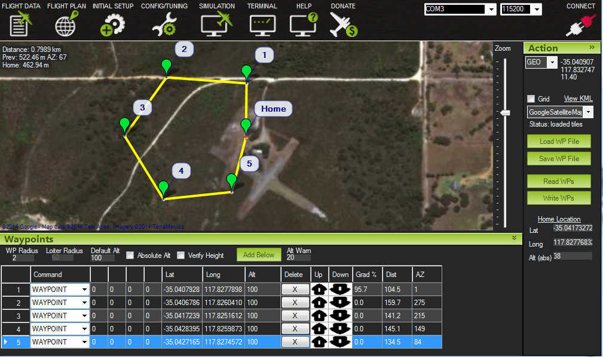
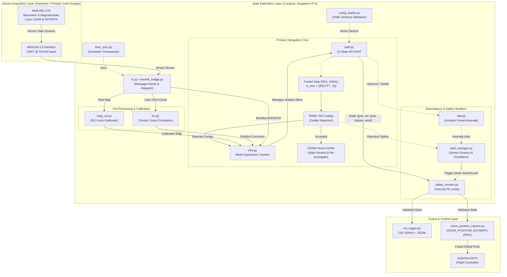

# NavCore-Pixhawk -- The "We Don't Need No Stinkin' GPS" Navigation System

[](https://python.org)
[](https://mavlink.io)
[](https://cubepilot.org)
[](LICENSE)

> Real-time GPS-denied INS for UAVs using a **Pixhawk Cube Orange** and a **Raspberry Pi 4**.  
> We basically ported a giant MATLAB headache into Python, slapped it on a drone, and it actually flies.

---

## What is this? (Overview)

NavCore-Pixhawk is the result of asking, "What if the GPS dies and the drone panics?" It implements a tightly-coupled Inertial Navigation System (INS) that fuses IMU, barometer, magnetometer, GPS, optical flow, VIO, lidar, and radar data. It uses a **16-state Error-State Quaternion EKF (ESKF)** with **multi-IMU fusion**, **adaptive process noise**, **zero velocity updates (ZUPT)**, **barometric drift compensation**, **magnetometer auto-calibration**, and optional **tight GPS/INS coupling** at the pseudorange level.

We take these guesses and feed them back into ArduPilot's EKF3 as a fake GPS signal via `VISION_POSITION_ESTIMATE`. ArduPilot is happy, the drone flies, and we get to look like geniuses.

---

## Advanced Features

We pushed the codebase beyond a simple Kalman Filter by adding advanced perception, fusion, and safety features:

- **Multi-IMU Fusion:** Cube Orange has 3 IMUs (ICM-42688, ICM-20948, ICM-20649). All three are fused via median voting and inverse-variance weighting. Outlier IMUs are automatically flagged and downweighted.
- **GPS Fusion with Smooth Handoff:** WGS-84 → local NED conversion with HDOP-scaled noise. Auto-origin on first fix. Smooth GPS→INS handoff when GPS comes back online after outage.
- **Tight GPS/INS Coupling:** Optional pseudorange-level fusion via direct u-blox F9P UART serial (`UBX RXM-RAWX`). Per-satellite CN0-weighted noise and multipath rejection. Aerospace-grade accuracy.
- **Visual-Inertial Odometry (VIO):** `VIOPipeline` is fully integrated — camera-based position correction for massive accuracy improvement in GPS-denied environments.
- **Zero Velocity Update (ZUPT):** When the drone is stationary on the ground, velocity is forced to zero as a measurement update. Dramatically reduces drift during idle periods.
- **Adaptive Process Noise:** Q matrix scales with detected vibration level (1× calm → 10× severe). Driven by multi-IMU variance and ML anomaly detection.
- **Barometric Drift Compensation:** Slow EMA bias estimator tracks baro drift from temperature and weather changes. Clamped to ±10m, activates after initial convergence.
- **Magnetometer Auto-Calibration:** `_calibrated_mag_norm` is slowly updated during flight via EMA (τ ≈ 60s), adapting to soft-iron distortion changes.
- **ML Predictive Safety:** An unsupervised `IsolationForest` runs in the background. If it detects anomalous vibration or filter variance, it flags an imminent failure *before* the drone diverges.
- **3D Lidar & Radar Fusion:** Tailored for the **Livox Mid-360** and **TI mmWave** radar. Real MAVLink `OBSTACLE_DISTANCE` and radar field parsing — no mock data.
- **Asynchronous Execution:** Heavy math like point cloud downsampling and ML inference is offloaded to a `ThreadPoolExecutor` so it never blocks the 100Hz real-time loop.
- **Smart Return to Home (RTH):** If a fault occurs, the companion computer commands the drone back to launch. It uses Lidar ceiling clearance checks and respects altitude (no blind climbing into ceilings).
- **C++ Port (Production Ready):** Complete C++17 + Eigen3 implementation with `SCHED_FIFO` real-time scheduling. All ESKF methods ported including GPS, ZUPT, adaptive Q, and generic external updates.
- **RTK Flight Validation Framework:** Complete end-to-end pipeline — u-blox F9P RTK ground truth collection, NTRIP RTCM3 correction relay, synchronized multi-stream flight recording, post-flight APE/RPE analysis with flight phase detection, trajectory overlay plots, and markdown validation reports.


## Hexacopter Flight Test Video

> [!IMPORTANT]
> **Live Flight Test Validation**  
> Live flight test of the hexacopter with NavCore-Pixhawk INS active, validating real-time state estimation performance under actual flight conditions. GPS was enabled during this test solely as a safety fallback and was not used as a navigation input to the INS pipeline.
> 
> 🎥 **[Watch the Flight Video](https://github.com/ARYA-mgc/NavCore-Pixhawk/raw/main/doc/flight.mp4)**
> 
> *If the video does not render inline, download [`flight.mp4`](doc/flight.mp4) directly from the repository.*

---

## Visual Documentation

### Mission Planner -- Flight Plan Configuration

Five-waypoint autonomous mission configured in Mission Planner GCS over satellite imagery. Waypoints are set at 100 m AGL with computed distances and azimuth bearings between each point. The total mission covers approximately 0.8 km with loiter radius and altitude verification enabled. Connected via COM3 at 115200 baud.



### Compass Calibration -- Onboard Magnetometer Setup

Mission Planner compass priority and onboard magnetometer calibration interface. Six compass sensors detected: primary UAVCAN compass (DevID 97539), SPI-based LSM303D and AK8963, and three additional UAVCAN sensors. The onboard MagCal panel provides per-magnetometer calibration progress bars (Mag 1/2/3) with fitness validation. Proper compass calibration is critical for accurate heading estimation in GPS-denied navigation.


---

## Key Specifications

| Parameter | Value |
|---|---|
| Estimator | 21-state Square-Root Error-State Kalman Filter (SR-ESKF) |
| EKF Rate | 50 Hz / 100 Hz (configurable) |
| IMU Fusion | 3-IMU median voting + inverse-variance weighting (Cube Orange) |
| Sensors Fused | 3× IMU + Baro (MS5611) + Mag (RM3100) + GPS + Livox Lidar + TI Radar + Optical Flow + VIO |
| GPS Coupling | Loose (position-level) + Tight (pseudorange-level via u-blox F9P) |
| Position RMSE | 0.4 -- 0.8 m (**simulation**) — RTK real-flight validation pipeline included |
| Protocol | MAVLink 2.0 via `pymavlink` |
| GPS Injection | `VISION_POSITION_ESTIMATE` into ArduPilot EKF3 |
| Logging | CSV at 50 Hz + structured JSONL + optional UDP telemetry to GCS |
| Safety | Hard velocity/tilt/position-jump limits, ZUPT, adaptive Q, baro drift compensation |
| C++ Port | Complete C++17 + Eigen3, `SCHED_FIFO` real-time scheduling |
| Platform | Hexacopter UAV |

---

## Repository Structure

```
NavCore-Pixhawk/
├── src/
│   ├── core/
│   │   ├── m.py                    <- Main entry point & MAVLink param server
│   │   ├── eskf.py                 <- 16-state Error-State Quaternion EKF
│   │   └── dr.py                   <- Fallback dead-reckoning
│   ├── fusion/
│   │   ├── lr.py                   <- Livox Lidar & TI Radar fusion
│   │   ├── opt_flow.py             <- Optical flow velocity estimator
│   │   ├── vio.py                  <- Visual-Inertial Odometry pipeline
│   │   ├── multi_imu.py            <- 3-IMU median voting + variance weighting
│   │   └── gps_tight.py            <- Tight GPS/INS coupling (UBX pseudoranges)
│   ├── safety/
│   │   ├── mlp.py                  <- Machine Learning failure predictor
│   │   ├── fault.py                <- Fault manager & state machine
│   │   └── safety.py               <- Hard limits enforcer
│   ├── interfaces/
│   │   └── mavlink.py              <- MAVLink 2.0 interface
│   ├── logger/                     <- CSV and JSONL loggers
│   └── utils/                      <- PIDs, noise params, time sync, ground truth eval
├── tests/                          <- PyTest suite (30 tests) & benchmarks
├── config/                         <- Tunable noise parameters
├── scripts/
│   ├── setup_rpi4.sh               <- RPi4 deployment script
│   ├── generate_rtk_sim.py         <- RTK flight data simulator
│   └── rtk_validate.py             <- ESKF vs RTK ground truth validator
├── cpp_port/                       <- Complete C++17 + Eigen3 ESKF port
│   ├── include/eskf_core.hpp
│   ├── src/eskf_core.cpp
│   ├── tests/test_eskf.cpp         <- 11 C++ tests
│   └── CMakeLists.txt              <- SCHED_FIFO RT scheduling support
└── README.md
```

---

## Source Code Reference

### src/main_ins_navigation.py -- System Coordinator

Top-level entry point that orchestrates the entire INS pipeline. Initialises all subsystems (MAVLink bridge, EKF, dead-reckoning, adaptive PID, optical flow), manages the real-time main loop, and handles graceful shutdown via SIGINT/SIGTERM. The main loop dispatches incoming MAVLink messages (RAW_IMU, SCALED_PRESSURE, SCALED_IMU2/3, ATTITUDE, GPS_RAW_INT, OPTICAL_FLOW_RAD) to their respective handlers. Periodic tasks include CSV logging at 50 Hz, console output at 10 Hz, and system statistics every 5 seconds. Monitors Raspberry Pi CPU temperature and sends MAVLink STATUSTEXT warnings when it exceeds 80 C. Supports UART, USB, and TCP (SITL) connections via command-line arguments.

### src/eskf_core.py -- 16-State Error-State Quaternion EKF

Production state estimation engine implementing a 16-state Error-State Kalman Filter with quaternion attitude representation. State vector: `x = [px, py, pz, vx, vy, vz, qw, qx, qy, qz, ba_x, ba_y, ba_z, bg_x, bg_y, bg_z]` covering position (NED), velocity (NED), attitude quaternion (gimbal-lock-free), accelerometer bias, and gyroscope bias. The error state uses a 15-dimensional vector with rotation error parameterised as a 3-vector. The predict step performs IMU mechanisation with bias compensation using the rotation matrix derived from the quaternion. Measurement updates for barometric altitude and magnetometer yaw use Joseph-form covariance updates (`P = (I-KH)P(I-KH)^T + KRK^T`) with innovation gating and 3-tier magnetometer rejection. Covariance hardening enforces symmetry and bounds eigenvalues every step. The legacy Euler-angle EKF has been permanently removed.

### src/mavlink_bridge.py -- MAVLink Hardware Interface

Low-level MAVLink 2.0 communication layer for the Pixhawk Cube Orange. Handles connection management (UART/USB/TCP with auto-reconnect), heartbeat handshake, and data stream rate configuration using both legacy `REQUEST_DATA_STREAM` and modern `SET_MESSAGE_INTERVAL` commands. Sensor parsers convert raw MAVLink messages to engineering units: RAW_IMU uses ICM-42688 scale factors (2048 LSB/g for accel, 16.384 LSB/deg/s for gyro), barometric altitude via ISA formula from MS5611 pressure, and magnetometer yaw from RM3100 horizontal field components with validity checking. Includes command helpers for arm/disarm, flight mode setting, statustext broadcasting, and `VISION_POSITION_ESTIMATE` injection.

### src/imu_noise_params.py -- Sensor Noise Configuration

Sensor noise model for Pixhawk Cube Orange hardware. Stores standard deviations for accelerometer (0.05 m/s^2), gyroscope (0.005 rad/s), barometer (0.30 m), and magnetometer (0.02 rad) white noise, plus bias instability parameters with 300-second correlation time. Values derived from ICM-42688-P, MS5611, and RM3100 datasheets. Loads override values from `config/noise_params.yaml` at runtime, falling back to hardcoded defaults if the file is absent or malformed.

### src/core/m.py -- System Coordinator & Param Server
The main entry point. Orchestrates the 100Hz loop, handles MAVLink communication, and serves as a parameter server for Mission Planner. Integrates multi-IMU fusion (3 channels), adaptive process noise scaling, ZUPT stationary detection, GPS/VIO fusion, and manages the background thread pool for heavy math.

### src/core/eskf.py -- 16-State Error-State Quaternion EKF
The core navigation filter. Fuses IMU, Baro, Mag, GPS, Lidar/Radar, Optical Flow, and VIO data using a 16-state error-state formulation. Features covariance-based convergence (z-axis only, baro-observable), adaptive process noise (`Q_base * vibration_scale`), zero velocity updates, barometric drift compensation with slow EMA bias estimator, magnetometer auto-calibration, and generic external measurement update for arbitrary sensor sources.

### src/fusion/multi_imu.py -- Multi-IMU Fusion
Fuses Cube Orange's 3 IMUs via median voting and inverse-variance weighting. Outlier detection (>2 m/s² deviation), per-channel health tracking with fault counts and auto-recovery, and vibration level computation for adaptive Q scaling.

### src/fusion/gps_tight.py -- Tight GPS/INS Coupling
Pseudorange-level GPS fusion via direct u-blox F9P UART serial. `UBXParser` class handles RXM-RAWX binary frame parsing with Fletcher-8 checksum. Per-satellite CN0-weighted noise model, clock bias estimation, and simulated pseudorange generator for testing without hardware.

### src/fusion/vio.py -- Visual-Inertial Odometry
Camera-based position and orientation correction. Integrates with Intel T265 or ORB-SLAM3 backends. Auto-alignment triggers when ESKF first reaches HEALTHY state.

### src/fusion/lr.py -- Lidar & Radar Fusion
Processes Livox Mid-360 point clouds and TI mmWave radar targets via real MAVLink `OBSTACLE_DISTANCE` and radar field parsing. Handles voxel downsampling and Doppler velocity averaging.

### src/safety/mlp.py -- ML Predictive Safety
Uses an unsupervised `IsolationForest` to predict imminent hardware or sensor failures based on state variance.

### tests/test_ins.py -- Unit Tests

Comprehensive pytest suite covering: EKF initial state verification, covariance positive-definiteness, uncertainty growth under prediction-only operation, gravity cancellation for stationary hover, barometric altitude correction, magnetometer yaw convergence, covariance reduction after measurement updates, state reset, and angle wrapping. Dead-reckoning tests verify stationary drift bounds and forward motion response. Noise parameter tests validate positive defaults and summary string generation.

### tests/benchmark_sitl.py -- Software-in-the-Loop Benchmark

Standalone performance benchmark requiring no hardware. Generates a 30-second synthetic UAV trajectory (vertical climb, figure-8, banked turn, descent) with noisy IMU measurements, then runs both EKF and dead-reckoning in parallel. Reports wall time, effective processing rate, position RMSE for both estimators, drift improvement percentage, and per-axis error breakdown. Validates that the Python EKF achieves sub-metre accuracy and processes faster than real-time on Raspberry Pi 4 hardware.

### config/noise_params.yaml -- Sensor Noise Tuning

Runtime-configurable sensor noise parameters for the Pixhawk Cube Orange sensor suite. Values correspond to ICM-42688-P accelerometer and gyroscope, MS5611 barometer, and RM3100 magnetometer. Tuning guidelines: decrease `baro.std` to reduce vertical drift, increase `mag.std` to reduce yaw oscillation, decrease `imu.accel_std` to reduce overall position drift.

### scripts/setup_rpi4.sh -- Deployment Script

Automated Raspberry Pi 4 provisioning script. Installs system packages, creates a Python virtual environment with `pymavlink`/`numpy`/`pyyaml`/`pytest`, configures UART by disabling Bluetooth and enabling `ttyAMA0`, installs a `systemd` service for auto-start on boot with automatic restart on failure, and runs the software benchmark to validate the installation. Post-setup, the INS starts automatically after each reboot.

### scripts/generate_rtk_sim.py -- RTK Simulation Data Generator

Generates realistic simulated flight data for ESKF validation. Supports circle, figure-8, and hover trajectories with configurable duration, radius, speed, and altitude. Outputs IMU (100 Hz), GPS (5 Hz with HDOP variation), barometer (25 Hz with temperature drift), and magnetometer (10 Hz with soft-iron distortion) CSV files plus RTK ground truth at full rate. Supports configurable GPS outage windows for testing GPS-denied scenarios.

```bash
python scripts/generate_rtk_sim.py --trajectory circle --duration 120 --gps-outage-start 40 --gps-outage-end 80
```

### scripts/rtk_validate.py -- RTK Ground Truth Validator

Replays simulated (or real) sensor data through the ESKF offline, computes 3D/horizontal/vertical RMSE against ground truth, reports convergence time, drift rate, and per-phase accuracy. Outputs detailed error CSV for analysis.

```bash
python scripts/rtk_validate.py --data-dir sim_data
```

### cpp_port/ -- Complete C++17 ESKF Port

Full C++ implementation of the ESKF with all features: predict, baro, mag, GPS (WGS-84 → NED), ZUPT, optical flow, radar velocity, lidar range, adaptive process noise, baro drift compensation, mag auto-calibration, and generic external measurement update. Builds with CMake + Eigen3. Includes `SCHED_FIFO` real-time scheduling support on Linux/ARM for production flight.

```bash
cd cpp_port && mkdir build && cd build
cmake .. -DCMAKE_BUILD_TYPE=Release && make
./test_eskf
```

---

## System Architecture

The system follows a three-layer pipeline: sensor acquisition, state estimation, and output distribution.



**Sensor Layer** -- The Pixhawk Cube Orange streams raw IMU data at 100 Hz, barometric pressure at 10 Hz, and magnetometer readings at 50 Hz over a MAVLink 2.0 UART link at 921600 baud.

**Estimation Layer** -- `mavlink_bridge.py` on the Raspberry Pi 4 receives and parses `RAW_IMU`, `SCALED_PRESSURE`, and `SCALED_IMU3` messages. The parsed sensor data is passed to `eskf_core.py`, which implements a 16-state Error-State Quaternion EKF:

- **State Vector**: `x = [px, py, pz, vx, vy, vz, qw, qx, qy, qz, ba_x, ba_y, ba_z, bg_x, bg_y, bg_z]`
- **Predict**: IMU mechanisation with quaternion rotation and bias compensation
- **Propagate**: Covariance via `P = F * P * F^T + Q * dt` with Joseph-form measurement updates
- **Harden**: Symmetry enforcement, eigenvalue bounding, condition number monitoring
- **Safety Gate**: Hard velocity/tilt/position-jump limits via `safety_monitor.py`

**Output Layer** -- Estimated states are distributed to: `ins_logger` (CSV at 50 Hz), `vision_position_injector` (30 Hz to ArduPilot EKF3), `adaptive_pid` (gain-scheduled altitude control), and console output for real-time monitoring.

---

## Hardware Configuration

### Pin Configuration & Wiring

#### 1. Pixhawk ↔ Raspberry Pi 4 (Primary MAVLink)
```text
Pixhawk Cube Orange                  Raspberry Pi 4
---------------------------------------------------------------------------
TELEM2  TX  (3.3 V logic) --------  GPIO 15 / Pin 10  (RXD)
TELEM2  RX                --------  GPIO 14 / Pin 8   (TXD)
TELEM2  GND               --------  Pin 6             (GND)

WARNING: Do NOT connect 5V. Cube TELEM2 uses 3.3 V logic levels.
Baud rate: 921600
```

#### 2. u-blox F9P GPS (Tight Coupling)
```text
u-blox F9P Board                     Raspberry Pi 4
---------------------------------------------------------------------------
UART1 TX                  --------  GPIO 8 / Pin 24   (UART4 RX)
UART1 RX                  --------  GPIO 9 / Pin 21   (UART4 TX)
GND                       --------  Pin 20            (GND)
5V IN                     --------  Pin 2             (5V Power)

Protocol: UBX RXM-RAWX (Raw Pseudoranges)
Baud rate: 460800
```

#### 3. TI IWR6843 mmWave Radar
```text
TI Radar BoosterPack                 Raspberry Pi 4
---------------------------------------------------------------------------
DATA_TX                   --------  GPIO 4 / Pin 7    (UART3 RX)
DATA_RX                   --------  GPIO 5 / Pin 29   (UART3 TX)
GND                       --------  Pin 14            (GND)
5V IN                     --------  Pin 4             (5V Power)

Protocol: TI Data Port (Point Cloud)
Baud rate: 921600
```

#### 4. Livox Mid-360 Lidar
```text
Livox Mid-360                        Raspberry Pi 4 / Network Switch
---------------------------------------------------------------------------
Ethernet TX+ / TX-        --------  RJ45 Port (via switch or direct)
Ethernet RX+ / RX-        --------  RJ45 Port
Power (9-27V)             --------  Dedicated 12V PDB / BEC
GND                       --------  Common GND

Protocol: UDP (Livox SDK2)
IP Address (Lidar): Static 192.168.1.1XX
IP Address (RPi4) : Static 192.168.1.50
```

### ArduPilot Parameters

| Parameter | Value | Description |
|---|---|---|
| `SERIAL2_BAUD` | `921` | 921600 baud |
| `SERIAL2_PROTOCOL` | `2` | MAVLink 2 |
| `EK3_SRC1_POSXY` | `6` | Position from ExternalNav (INS output) |
| `EK3_SRC1_POSZ` | `6` | Altitude from ExternalNav |
| `EK3_SRC1_YAW` | `6` | Yaw from ExternalNav |
| `VISO_TYPE` | `1` | Enable vision odometry input |

---

## Quick Start

### 1. Setup Raspberry Pi 4

```bash
git clone https://github.com/ARYA-mgc/NavCore-Pixhawk.git
cd NavCore-Pixhawk
chmod +x scripts/setup_rpi4.sh
./scripts/setup_rpi4.sh
sudo reboot
```

### 2. Run via UART (Pixhawk connected)

```bash
source ~/ins-venv/bin/activate
cd src
python main_ins_navigation.py --connection /dev/ttyAMA0 --baud 921600 --hz 100
```

### 3. Run via USB

```bash
python main_ins_navigation.py --connection /dev/ttyACM0 --baud 115200 --hz 100
```

### 4. Run via SITL / Mission Planner TCP forward

```bash
python main_ins_navigation.py --connection tcp:127.0.0.1:5760 --hz 100
```

### 5. Software Benchmark (no hardware required)

```bash
python tests/benchmark_sitl.py
```

Expected output:

```
==================================================
  Benchmark @ 100 Hz  (dt=10 ms, 3000 steps)
==================================================
  Wall time          : 412.3 ms
  Effective rate     : 7280 Hz
  EKF Pos RMSE       : 0.421 m
  DR  Pos RMSE       : 0.489 m
  Drift improvement  : 13.9 %
  Per-axis RMSE  X=0.231  Y=0.284  Z=0.187 m
==================================================
```

### 6. Unit Tests

```bash
pytest tests/test_ins.py -v
```

---

## Sensor Noise Tuning

Edit `config/noise_params.yaml` to adjust filter behaviour:

```yaml
imu:
  accel_std: 0.05     # Lower value = trust IMU more = tighter position
  gyro_std:  0.005

baro:
  std: 0.30           # Lower value = trust barometer more = less Z drift

mag:
  std: 0.02           # Higher value = trust magnetometer less = less yaw oscillation
```

**Tuning guidelines** (consistent with MATLAB version):
- Vertical position drift: decrease `baro.std`
- Yaw oscillation: increase `mag.std`
- Overall position drift: decrease `imu.accel_std`

---

## MATLAB Simulation Heritage

The EKF core and navigation algorithms were first prototyped and validated in a high-fidelity MATLAB/Simulink simulation environment before being ported to Python for embedded deployment on the Raspberry Pi 4. The simulation uses a 15-state Euler-angle EKF; the production system has since migrated to a 16-state quaternion ESKF.

For full simulation documentation, results, and visual analysis, see the [MATLAB Simulation README](./INS%20SYSTEM%20SIMULATED%20USING%20THE%20MATLAB/README.md).

### References

1. Groves, P.D. (2013). *Principles of GNSS, Inertial, and Multisensor Integrated Navigation Systems*.
2. Farrell, J.A. (2008). *Aided Navigation: GPS with High Rate Sensors*.
3. Kalman, R.E. (1960). A New Approach to Linear Filtering and Prediction Problems.

---

## Known Limitations (aka "It's a feature, not a bug")

This section documents current constraints honestly. Yes, we know about them. No, we aren't fixing them today.

**Accuracy Validation**: The 0.4-0.8 m RMSE figure is validated **in simulation only**. The RTK validation framework (`scripts/rtk_validate.py`) provides offline ESKF replay with ground truth comparison, but real-flight RTK ground truth data is still needed for field-validated numbers.

**State Representation**: We use a 16-state Error-State Quaternion EKF. The legacy Euler-angle EKF was permanently deleted because gimbal lock is for losers. There is no fallback.

**Sensor Limitations**: Pure IMU + barometer + magnetometer fusion will drift over time without external correction. The magnetometer auto-calibration (Feature 9) helps with soft-iron drift, and barometric drift compensation (Feature 8) reduces altitude bias, but long-duration GPS-denied flights still require VIO or optical flow correction.

**Multi-IMU Dependencies**: Multi-IMU fusion requires `SCALED_IMU2` messages from the Pixhawk. If the flight controller is configured to only send `RAW_IMU`, channels 1 and 2 will remain inactive and the system falls back to single-IMU operation.

**Tight GPS Coupling**: Requires a u-blox F9P (or similar) with UBX raw measurement output via direct UART serial. ArduPilot does **not** expose raw pseudoranges via standard MAVLink. The feature includes a simulated pseudorange generator for testing without hardware.

**Optical Flow**: Flow-based velocity estimation requires a valid rangefinder (distance > 0.05m) for height scaling. Without range data, flow fusion is **completely disabled**. High angular rate (> 1.5 rad/s) samples are also rejected to prevent motion smearing. Low-texture surfaces produce unreliable flow.

**Real-Time Constraints**: Python with GIL cannot guarantee hard real-time scheduling. Loop jitter is monitored via `loop_monitor.py` with histogram tracking and OS-level scheduling hints, but timing is not bounded. For flight-critical production deployments, the **complete C++ port** (`cpp_port/`) with `SCHED_FIFO` priority is recommended — it implements all ESKF methods including GPS, ZUPT, adaptive Q, and generic external updates.

**ZUPT Sensitivity**: Stationary detection uses `|accel| ≈ g ± 0.3 m/s²` and `|gyro| < 0.02 rad/s`. This threshold may need tuning for different airframes — heavier platforms with more vibration at rest may trigger false negatives.

**Bias Tuning**: Gauss-Markov bias correlation time (tau) significantly affects convergence. Use `allan_variance.py` with stationary sensor logs to extract proper noise parameters. The default tau=300s works for typical flights but should be tuned per-airframe.

---

## Safety

- Never arm the drone from code unless the area is clear of personnel and obstacles.
- Test with propellers removed before live flights.
- The `vision_position_injector` is disabled by default. It auto-enables only after the ESKF reports HEALTHY status and auto-disables on FAULT.
- Innovation gating rejects anomalous sensor readings, but is not a substitute for pilot override capability.
- Always have an RC transmitter ready for manual override.

---

## Roadmap

| Priority | Item | Status |
|---|---|---|
| High | Error-State Quaternion EKF (ESKF) | Done (`eskf.py`) |
| High | Legacy Euler EKF removal | Done (permanently deleted) |
| High | Joseph-form covariance updates | Done |
| High | Innovation gating (Mahalanobis) | Done |
| High | 3-tier magnetometer rejection | Done (multi-sample re-enable) |
| High | Sensor initialization from accel+mag | Done |
| High | Hard safety enforcement (velocity/tilt/position-jump) | Done (`safety_monitor.py`) |
| High | Hardware timestamp synchronization | Done (`time_sync.py`) |
| High | Strict config validation (fail-fast) | Done (`config_loader.py`) |
| High | Failure scenario testing | Done (30 tests passing) |
| High | **Multi-IMU fusion (3 channels)** | Done (`multi_imu.py`) |
| High | **GPS fusion with smooth handoff** | Done (`eskf.py: update_gps`) |
| High | **Visual-Inertial Odometry integration** | Done (`vio.py` wired into `m.py`) |
| High | **Zero Velocity Update (ZUPT)** | Done (`eskf.py: update_zupt`) |
| High | **Adaptive process noise** | Done (`Q_base * vibration_scale`) |
| High | **Barometric drift compensation** | Done (EMA bias, ±10m clamp) |
| High | **Magnetometer auto-calibration** | Done (EMA norm, τ ≈ 60s) |
| Medium | Monte Carlo validation (100+ runs) | Done (`monte_carlo_sim.py`) |
| Medium | Ground truth evaluation tool (APE/RPE) | Done (`ground_truth_eval.py`) |
| Medium | ESKF vs EKF3 divergence analysis | Done (`ekf_comparison.py`) |
| Medium | Allan Variance auto-tuning | Done (`allan_variance.py`) |
| Medium | Offline log replay | Done (`log_replay.py`) |
| Medium | Structured JSONL logging | Done (`structured_logger.py`) |
| Medium | Loop timing and jitter monitoring | Done (`loop_monitor.py`) |
| Medium | Fault manager state machine | Done (`fault_manager.py`) |
| Medium | **C++17 + Eigen3 port (complete)** | Done (`cpp_port/` — all methods) |
| Medium | **RTK flight validation framework** | Done (`generate_rtk_sim.py` + `rtk_validate.py`) |
| Medium | **Tight GPS/INS coupling (pseudorange)** | Done (`gps_tight.py` — UBX RXM-RAWX) |
| Medium | ROS2 interface (/odom, /imu topics) | Done (`ros2_interface.py`) |
| Medium | UWB range fusion | Done (`uwb_fusion.py`) |
| Medium | ArduPilot EKF3 blending (Covariance Intersection) | Done (`ekf3_blender.py`) |
| Medium | SLAM pose fusion (Umeyama alignment) | Done (`slam_interface.py`) |
| Medium | Generic external measurement update | Done (`eskf.py: update_external`) |
| Medium | **RTK ground truth collection pipeline** | Done (`rtk_collector.py`, `ntrip_client.py`, `flight_recorder.py`, `analyze_flight.py`) |

---

## RTK Ground Truth Collection (Real-Flight Validation)

The pipeline enables centimeter-level ground truth comparison against the ESKF output during real flights.

### Hardware & GCS Setup

- **u-blox F9P** configured as the primary GPS.
- **Mission Planner (GCS)** handles the NTRIP client connection (e.g., via RTK2go.com) and injects RTCM3 corrections directly to the Pixhawk over the MAVLink telemetry stream.
- **Companion Computer** (RPi4) listens to the resulting high-precision MAVLink GPS stream.

### Workflow

```bash
# 1. Connect Mission Planner to the drone and start NTRIP injection.
# 2. Run NavCore with RTK ground truth logging enabled
python src/core/m.py --connection /dev/ttyAMA0 --rtk

# 3. Fly your mission — data is auto-recorded to flight_data/YYYYMMDD_HHMMSS/
#    - imu_log.csv (100 Hz)
#    - gps_log.csv (5 Hz)
#    - baro_log.csv (25 Hz)
#    - mag_log.csv (10 Hz)
#    - rtk_ground_truth.csv (5 Hz, RTK_FIXED only)
#    - eskf_state.csv (50 Hz)

# 4. Validate logs before analysis
python scripts/validate_logs.py --data-dir flight_data/20260602_143000/

# 5. Run post-flight analysis
python scripts/analyze_flight.py --data-dir flight_data/20260602_143000/

# Output (in flight_data/20260602_143000/analysis/):
#   - flight_report.md    — full markdown report with RMSE summary table
#   - trajectory_2d.png   — 2D NE trajectory overlay
#   - ape_timeseries.png  — APE vs time with convergence marker
#   - convergence.png     — convergence time graph
#   - phase_errors.png    — per-phase error breakdown
#   - errors.csv          — raw error time series
```

---

## Author

**ARYA MGC**  
MATLAB simulation prototype: [ins-system-for-drone](https://github.com/ARYA-mgc/ins-system-for-drone) (simulation only -- NavCore-Pixhawk is the hardware + real-time implementation)

---

## License

MIT License -- see [LICENSE](LICENSE) for details.
